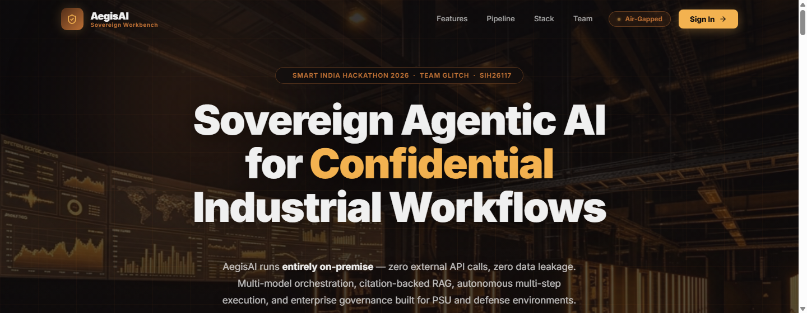
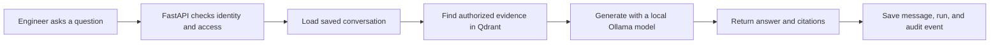

# Aegis AI

**An on-premise-oriented AI workbench for industrial engineering documents.**

Aegis AI helps engineers search technical documents and ask questions about the evidence they contain. The application combines a web workspace, an API, document retrieval, locally hosted language models, persistent conversations, and audit records.

> This is an active project, not a certified safety system. AI answers can be incomplete or wrong. Verify citations against the original document and keep engineering decisions under qualified human review.

## Screenshot



## How it works



<details>
<summary>What happens behind the scenes?</summary>

The browser sends a message and, when continuing a chat, its conversation ID. The API resolves the user and clearance on the server, loads that user's saved messages, and searches indexed documents that the user is permitted to access. A task router selects an available local model. The response, citations, and evidence information are returned to the workspace and saved so the conversation can be restored later.

The diagram describes the intended application flow; it is not a claim that any deployment is air-gapped or that generated answers are correct.
</details>

## Main features

| Feature | What it does |
|---|---|
| Document Q&A | Searches indexed PDFs and supported images and returns source/evidence information |
| Persistent chat | Stores conversations and messages in PostgreSQL |
| Local model routing | Selects an available Ollama model for supported task types |
| Access controls | Uses server-resolved user roles, clearance, and conversation ownership |
| Agent runs | Records execution steps for inspection |
| Audit trail | Stores hash-linked audit events and provides a chain verification endpoint |
| Reports and sandbox | Provides report-generation and restricted code-execution endpoints |
| Egress monitoring | Monitors and can block HTTP requests made through guarded `httpx` clients |

The egress monitor is not a firewall or proof of a complete air gap. Use network controls outside the application as well.

## Technology

| Part | Technology |
|---|---|
| Frontend | React, Vite, Nginx |
| API | FastAPI, Python |
| Relational data | PostgreSQL |
| Document retrieval | Qdrant, dense and sparse retrieval |
| Local inference | Ollama |
| Cache | Redis |
| Deployment | Docker Compose |

## Run with Docker Compose

You need Docker and Docker Compose. From the repository root:

```powershell
Copy-Item .env.example .env
# Review .env and docker-compose.yml; set private credentials and provision a user.
docker compose up --build
```

Then open:

- Workbench: <http://localhost:3000>
- API health: <http://localhost:8000/api/v1/health>
- API reference: <http://localhost:8000/docs>

Ollama model downloads are disabled by default. Provision the configured models before expecting local chat to work. See `.env.example` and `docker-compose.yml` for configuration.

## Repository map

| Path | Contents |
|---|---|
| `frontend/` | React application and API client |
| `backend/app/api/v1/endpoints/` | Authentication, chat, conversations, documents, models, audit, reports, and sandbox routes |
| `backend/app/services/` | Orchestration, retrieval, model routing, ingestion, reporting, and egress services |
| `backend/app/db/` | Database models and persistence helpers |
| `backend/tests/` | Backend automated tests |
| `docker-compose.yml` | Local multi-service deployment |
| `docs/screenshots/` | Project screenshot |

## Useful API routes

The full API schema is available at `/docs`.

| Route | Purpose |
|---|---|
| `POST /api/v1/auth/login` | Sign in |
| `POST /api/v1/chat` | Send a chat message |
| `POST /api/v1/chat/stream` | Stream a chat response |
| `GET /api/v1/conversations` | List accessible conversations |
| `GET /api/v1/conversations/{id}` | Restore a conversation |
| `GET /api/v1/document/list` | List accessible indexed documents |
| `GET /api/v1/models` | View the model catalog |
| `GET /api/v1/agent-runs` | View agent runs |
| `GET /api/v1/audit/logs` | View permitted audit events |
| `GET /api/v1/audit/verify` | Verify the audit chain |

Authenticated routes require a bearer token.

## Development checks

Run from the indicated folder:

```powershell
# Backend
Set-Location backend
pytest -q

# Frontend
Set-Location ..\frontend
npm ci
npm run lint
npm run build
```

## Project notes

- Protect `.env`, credentials, uploaded documents, model files, and generated artifacts; do not commit real operational data.
- Retrieval and model quality depend on the indexed sources, local model availability, and deployment configuration.
- OCR and generated answers can be wrong. Review source documents before acting.
- No license file is currently provided, so do not assume reuse or redistribution rights.
