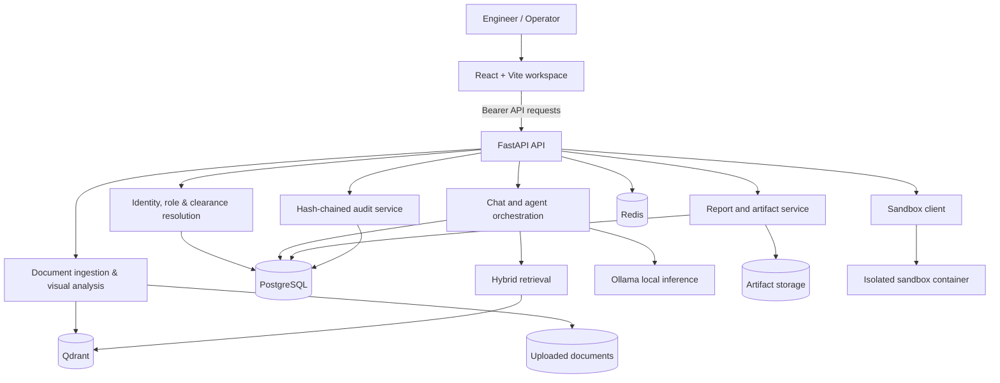
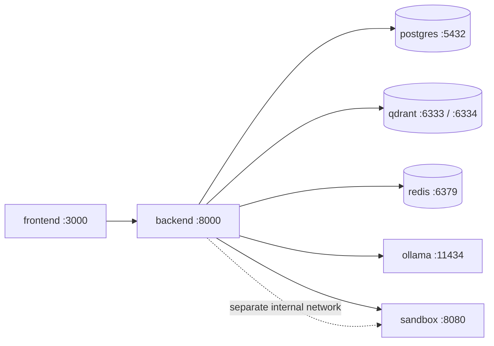
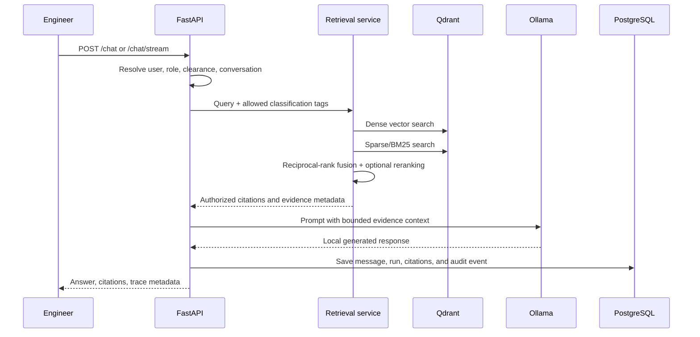
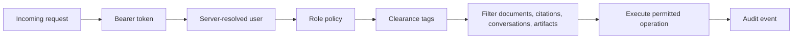

# Aegis AI

**Aegis AI is a sovereign, evidence-grounded engineering workbench for searching industrial documents, investigating equipment issues, and producing auditable engineering artifacts.**

It combines a React workspace, FastAPI services, PostgreSQL persistence, Qdrant hybrid retrieval, locally hosted Ollama models, and a policy-controlled execution sandbox. The design is suitable for controlled on-premise deployments where document provenance, classification boundaries, and human review matter.

> **Safety notice:** Aegis AI is an active engineering tool, not a certified safety instrument or a substitute for a qualified engineer. AI output, OCR, retrieval, calculations, and recommendations may be incomplete or incorrect. Verify every decision against the original source document and applicable procedures.

[](#development-and-validation)
[](#technology-stack)
[](#deployment)

## Contents

- [Why Aegis AI](#why-aegis-ai)
- [Capabilities](#capabilities)
- [System architecture](#system-architecture)
- [Evidence and retrieval pipeline](#evidence-and-retrieval-pipeline)
- [Security and governance model](#security-and-governance-model)
- [Artifacts and provenance](#artifacts-and-provenance)
- [Technology stack](#technology-stack)
- [Repository layout](#repository-layout)
- [Quick start](#quick-start)
- [Configuration](#configuration)
- [API surface](#api-surface)
- [Development and validation](#development-and-validation)
- [Operational notes and limitations](#operational-notes-and-limitations)

## Why Aegis AI

Industrial teams often have the information needed to diagnose an issue, but it is distributed across manuals, P&IDs, inspection reports, drawings, and calculation sheets. Aegis AI makes that evidence searchable while keeping the answer tied to the source:

1. Upload a PDF or supported image.
2. Extract text, tables, OCR content, layout, document classification, and equipment identifiers.
3. Index layout-aware chunks in a hybrid dense/sparse Qdrant collection.
4. Ask a question in a persistent, access-controlled conversation.
5. Retrieve only evidence permitted by the user's clearance.
6. Generate a response with normalized citations and source geometry.
7. Preserve the conversation, agent trace, audit event, and optional report artifact.

## Capabilities

| Capability | Technical behavior |
|---|---|
| **Evidence-grounded Q&A** | Hybrid dense and BM25-style sparse retrieval, reciprocal-rank fusion, optional cross-encoder reranking, and citation normalization |
| **Document intelligence** | PDF and image ingestion, PyMuPDF parsing, optional Tesseract/PIL OCR, table counts, page metadata, bounding boxes, P&ID/drawing detection, and equipment-tag extraction |
| **Persistent engineering workspace** | PostgreSQL-backed users, conversations, messages, agent runs, audit records, and generated artifacts |
| **Local model routing** | Ollama-backed general, coding, and optional vision models selected by task |
| **Classification-aware access** | Server-resolved roles and clearance tags filter documents, citations, conversations, and downloadable artifacts |
| **Agent observability** | Agent runs expose task, model, status, ordered steps, final result, and error state |
| **Tamper-evident governance** | SHA-256 hash-linked audit entries with chain verification |
| **Engineering artifacts** | Deterministic local report generation in DOCX, PDF, XLSX, or PPTX with source count, content hash, classification, and review status |
| **Controlled calculations** | Python sandbox with static AST checks, time/output/input limits, no network flag, and an isolated Docker service |
| **Egress controls** | Guarded HTTP clients can classify and block outbound requests; this complements, but does not replace, network-level controls |

## System architecture



### Runtime service topology

The default Compose deployment creates six application/data services:



The frontend and backend are exposed on loopback by default. The sandbox is attached to an `internal: true` Docker network and runs read-only with dropped capabilities, `no-new-privileges`, a 256 MB memory limit, a 0.5 CPU limit, and a no-execute temporary filesystem.

## Evidence and retrieval pipeline



### Indexing contract

The ingestion pipeline stores each chunk with metadata used for retrieval and UI evidence rendering:

| Field | Purpose |
|---|---|
| `chunk_id` | Stable chunk identity for citation and audit correlation |
| `doc_name` / `stored_filename` | Original and server-side document references |
| `page`, `section_title` | Human-readable source location |
| `classification_tag` | Clearance filter key |
| `equipment_tags`, `object_tag` | Asset-aware search and drawing navigation |
| `bbox`, `page_width`, `page_height` | Evidence geometry for page highlighting |
| `document_type`, `drawing_type` | Distinguishes technical documents and engineering drawings |
| `text` | Extracted/OCR text used for embeddings and citations |

The default retrieval configuration uses 400-token chunks with 50-token overlap, prefetches up to 20 candidates, and returns up to 5 final results after fusion/reranking. These are configuration values, not quality guarantees.

## Security and governance model

### Request authorization



- Roles include `ADMIN`, `ENGINEER`, `OPERATOR`, and `AUDITOR`.
- Clearance is resolved by the backend; the frontend does not choose a user's role or clearance.
- Evidence and report classifications are checked against clearance before use or download.
- Operational recommendations and verification steps can mark an artifact `REVIEW_REQUIRED`.
- Report approval is restricted to authorized reviewer roles and is separately audited.
- The audit service links records with previous and entry hashes and exposes verification through the API.
- Egress monitoring is an application control. It is not a firewall, network segmentation, or proof of an air gap.

### Sandbox policy

User code is checked for forbidden imports/calls before execution. The preferred path is the isolated `sandbox` service. Local fallback is intended for development compatibility only and should be disabled in controlled deployments with `SANDBOX_ALLOW_LOCAL_FALLBACK=false`.

## Artifacts and provenance

Artifacts are first-class records, not anonymous files. Each generated report has:

| Artifact property | Meaning |
|---|---|
| `artifact_id` | Public identifier such as `ART-<uuid>` |
| `report_type` | Structured report category |
| `format` | `DOCX`, `PDF`, `XLSX`, or `PPTX` |
| `classification` | Classification applied to the artifact |
| `source_count` | Number of evidence blocks included |
| `agent_run_id` | Optional link to the originating agent run |
| `content_hash` | SHA-256 digest of the generated bytes |
| `audit_reference` | Audit event associated with generation |
| `status` | `DRAFT`, `REVIEW_REQUIRED`, or `APPROVED` |

Evidence blocks retain source document, page, section, extraction method, classification, and snippet/provenance data. Reports are generated from structured evidence and include a human-review marker when they contain an operational recommendation, recommended action, or verification requirement.

## Technology stack

| Layer | Technologies |
|---|---|
| UI | React 18, Vite, React Router, Axios, `react-pdf`, Lucide, Motion |
| API | Python, FastAPI, Pydantic Settings, Uvicorn |
| Persistence | PostgreSQL, SQLAlchemy, Alembic |
| Retrieval | Qdrant, FastEmbed dense embeddings, BM25 sparse embeddings, optional BGE cross-encoder reranker |
| Inference | Ollama with configurable local chat/coding/vision models |
| Document processing | PyMuPDF, optional Tesseract, Pillow, table/layout metadata |
| Artifacts | python-docx, ReportLab, openpyxl, python-pptx |
| Cache/integration | Redis, HTTPX |
| Deployment | Docker Compose, Nginx, isolated sandbox container |
| Validation | pytest, ESLint, Vite production build |

## Repository layout

| Path | Responsibility |
|---|---|
| `frontend/src/` | React application, workspace views, evidence panels, citations, audit UI, and API client |
| `backend/app/api/v1/endpoints/` | Auth, chat, conversations, documents, models, agent runs, audit, reports, sandbox, and health routes |
| `backend/app/services/` | Agent orchestration, hybrid RAG, ingestion, model registry/router, reports, audit, security, egress, and sandbox services |
| `backend/app/db/` | SQLAlchemy models, sessions, repositories, and persistence |
| `backend/alembic/` | Database migration environment and schema revisions |
| `backend/tests/` | Integration and unit coverage for auth, RAG, citations, audit, reports, sandbox, and model behavior |
| `backend/uploaded_docs/` | Runtime document storage; keep operational data out of source control |
| `artifacts/` | Runtime generated artifact storage; created by the report service |
| `sandbox/` | Isolated code-execution service image |
| `docker-compose.yml` | Local multi-service topology, health checks, volumes, and network policy |
| `.env.example` | Configuration template and safe placeholder defaults |
| `docs/screenshots/` | Product screenshots used by project documentation |

## Quick start

### Prerequisites

- Docker Desktop with Docker Compose
- Git
- Optional for local development: Python 3.11+ and Node.js 18+

### Docker Compose

From the repository root:

```powershell
Copy-Item .env.example .env
# Edit .env: set a unique SECRET_KEY, POSTGRES_PASSWORD, and bootstrap user JSON.
docker compose up --build
```

Open:

| URL | Purpose |
|---|---|
| <http://localhost:3000> | Aegis AI web workbench |
| <http://localhost:8000/api/v1/health> | API health check |
| <http://localhost:8000/docs> | Interactive OpenAPI documentation |

The default Compose configuration does not download Ollama models automatically. Provision the configured models in the Ollama volume before using local chat, or adjust the model variables for an environment that already contains them.

### First-use flow

1. Configure `AEGIS_BOOTSTRAP_USERS_JSON` with development users.
2. Start Compose and wait for all health checks.
3. Sign in through the workbench.
4. Upload a PDF, P&ID, or supported image with an authorized classification.
5. Ask a question and inspect the citation/source panel.
6. Generate an artifact only after reviewing its evidence and status.

## Configuration

The complete template is in `.env.example`. Important settings include:

| Variable | Default | Role |
|---|---|---|
| `DATABASE_URL` | project-local placeholder | PostgreSQL connection |
| `QDRANT_COLLECTION` | `industrial_docs` | Vector collection |
| `DENSE_EMBEDDING_MODEL` | `BAAI/bge-small-en-v1.5` | Dense retrieval model |
| `SPARSE_EMBEDDING_MODEL` | `Qdrant/bm25` | Sparse retrieval model |
| `RERANKER_MODEL` | `BAAI/bge-reranker-base` | Optional result reranker |
| `DEFAULT_CHAT_MODEL` | `qwen2.5:3b` | General Ollama model |
| `DEFAULT_CODER_MODEL` | `qwen2.5-coder:3b` | Coding/sandbox-support model |
| `EGRESS_MONITOR_ENABLED` | `true` | Enable egress instrumentation |
| `EGRESS_ENFORCE` | `true` | Block disallowed monitored requests |
| `SANDBOX_ALLOW_LOCAL_FALLBACK` | development default | Permit local compatibility execution |
| `ARTIFACT_STORAGE_DIR` | `artifacts` | Generated artifact directory |

Never commit `.env`, credentials, uploaded operational documents, model files, or generated artifacts.

## API surface

The authoritative contract is the generated OpenAPI schema at `/docs`. Representative routes:

| Method | Route | Purpose |
|---|---|---|
| `POST` | `/api/v1/auth/login` | Authenticate a user |
| `POST` | `/api/v1/chat` | Complete a chat request |
| `POST` | `/api/v1/chat/stream` | Stream a chat response |
| `GET` | `/api/v1/conversations` | List accessible conversations |
| `GET` | `/api/v1/conversations/{id}` | Restore a conversation |
| `POST` | `/api/v1/document/upload` | Ingest one PDF/image |
| `POST` | `/api/v1/document/upload-batch` | Ingest multiple documents |
| `GET` | `/api/v1/document/list` | List authorized indexed documents |
| `POST` | `/api/v1/reports/generate` | Generate a structured engineering artifact |
| `GET` | `/api/v1/reports/{artifact_id}/download` | Download an authorized artifact |
| `POST` | `/api/v1/reports/{artifact_id}/approve` | Approve a reviewable artifact |
| `POST` | `/api/v1/sandbox/execute` | Run a policy-checked calculation |
| `GET` | `/api/v1/agent-runs` | Inspect agent execution traces |
| `GET` | `/api/v1/audit/logs` | View permitted audit events |
| `GET` | `/api/v1/audit/verify` | Verify the audit hash chain |

Authenticated routes require a bearer token. Request/response models and status codes are available in the OpenAPI UI.

## Development and validation

### Backend

```powershell
Set-Location backend
pytest -q
```

Focused test areas include:

- `test_hybrid_rag.py` and `test_citation_metadata.py`
- `test_auth_persistence.py` and `test_conversations.py`
- `test_audit_chain.py` and `test_persistent_audit.py`
- `test_report_service.py`
- `test_sandbox.py`
- `test_vision_analysis.py`

### Frontend

```powershell
Set-Location frontend
npm ci
npm run lint
npm run build
```

For local UI iteration, use `npm run dev`. The production image serves the built frontend through Nginx.

## Operational notes and limitations

- Retrieval quality depends on document quality, OCR output, embedding availability, chunk settings, and the selected model.
- A citation is evidence for review, not proof that a generated conclusion is correct.
- OCR may misread symbols, dimensions, tags, and handwritten content.
- Classification filtering is application-level authorization and must be paired with host, network, volume, and identity controls.
- Egress monitoring cannot guarantee that every process or library is network-isolated.
- The development local sandbox fallback is not equivalent to the hardened container.
- Protect PostgreSQL, Qdrant, Redis, Ollama volumes, uploaded documents, and `artifacts/` with deployment-specific access controls and backups.
- No license file is currently provided; do not assume redistribution rights.

## Project status

Aegis AI is under active development. Interfaces, model defaults, migrations, and operational guarantees may change as the system moves toward deployment-specific validation.
