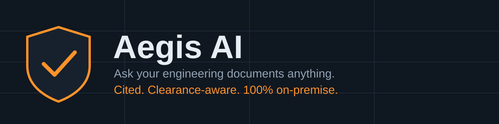
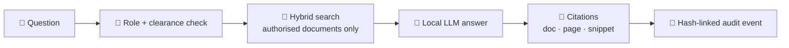
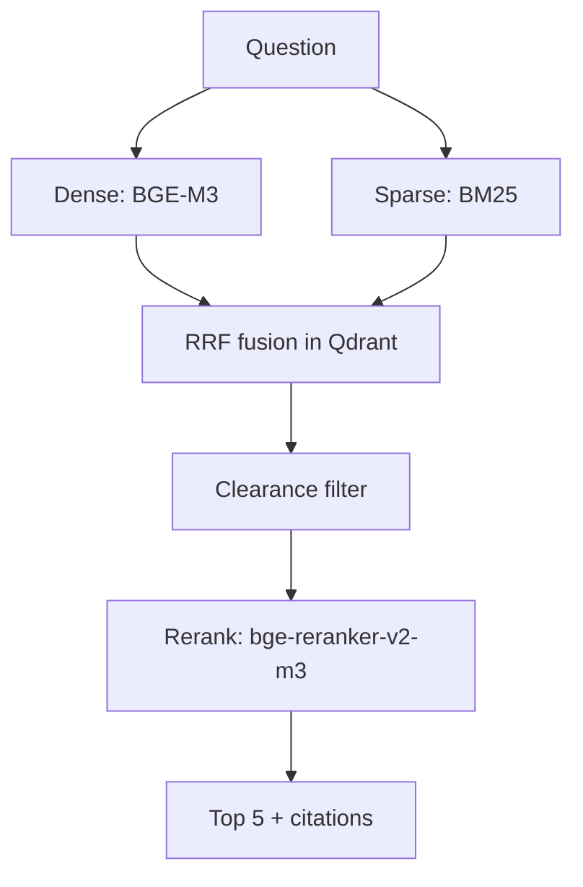

<div align="center">



[](https://github.com/AbdulRehan-7designs/Ageis-AI/actions/workflows/ci.yml)


### [▶ Open the interactive deep dive](https://abdulrehan-7designs.github.io/Ageis-AI/)

Click through the architecture, retrieval pipeline, chunking, audit chain, and security view.

</div>

---

## The problem

| 📚 Too many pages | 🔒 No cloud allowed | ❓ No source, no trust |
| --- | --- | --- |
| Engineers search thousands of pages of manuals and SOPs | Restricted networks can't send documents to cloud AI | AI answers without citations can't be verified |

## The solution



## Highlights

| | |
| --- | --- |
| 📌 **Cited answers** | Document, page, and snippet with every response |
| 🏠 **Runs locally** | Embeddings, retrieval, reranking, and LLMs are self-hosted |
| 🔐 **Clearance-aware** | Filtering at query time, verified again after reranking |
| 🧾 **Auditable** | Tamper-evident audit chain with a verify endpoint |
| 🎯 **Precise** | Meaning search plus BM25 catches tags like `P-204` |

<details>
<summary><b>🔍 How retrieval works</b></summary>



Details: [docs/rag-design.md](docs/rag-design.md)
</details>

<details>
<summary><b>🏗️ Architecture</b></summary>


Details: [docs/architecture.md](docs/architecture.md)
</details>

<details>
<summary><b>🔒 Security model</b></summary>

Server-side identity and clearance, ownership checks, hash-linked audit log, egress monitoring, restricted sandbox. The egress monitor is not a firewall or proof of an air gap.

Details: [docs/security.md](docs/security.md) · [SECURITY.md](SECURITY.md)
</details>

<details>
<summary><b>🔌 API</b></summary>

Swagger at `/docs`. Full table: [docs/api.md](docs/api.md)
</details>

## Run it

```bash
git clone https://github.com/AbdulRehan-7designs/Ageis-AI.git && cd Ageis-AI
cp .env.example .env      # set private credentials
docker compose up --build
```

Workbench `localhost:3000` · API docs `localhost:8000/docs` · Health `localhost:8000/api/v1/health`

> Ollama model downloads are off by default. Provision your models first.

## Stack


## Notes

Not a certified safety system. AI can be wrong, so verify citations and keep a human in the loop. No license is set yet.

<div align="center">

**Built by [Abdul Rehan](https://github.com/AbdulRehan-7designs)** · MJCET, Hyderabad · Smart India Hackathon 2026

</div>
