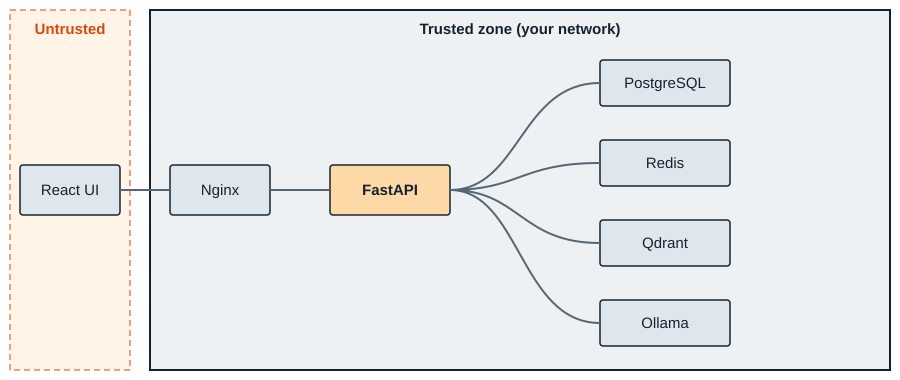
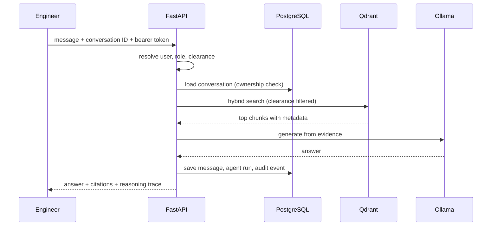

# Architecture

Aegis AI is a set of Docker Compose services behind a single FastAPI application.

## Services

| Service | Role |
| --- | --- |
| React UI (Vite) served by Nginx | Workbench on port 3000 |
| FastAPI | Auth, chat, conversations, documents, models, audit, reports, sandbox |
| PostgreSQL | Conversations, messages, agent runs, audit events |
| Redis | Cache |
| Qdrant | Collection `industrial_docs` with dense and sparse vectors |
| Ollama | Locally hosted language models |

## Request lifecycle

## Code map

| Path | Contents |
| --- | --- |
| `backend/app/api/v1/endpoints/` | Route handlers |
| `backend/app/services/` | Orchestration, retrieval, model routing, ingestion, reporting, egress |
| `backend/app/db/` | Models and persistence helpers |
| `backend/tests/` | Automated tests |
| `frontend/` | React app and API client |
