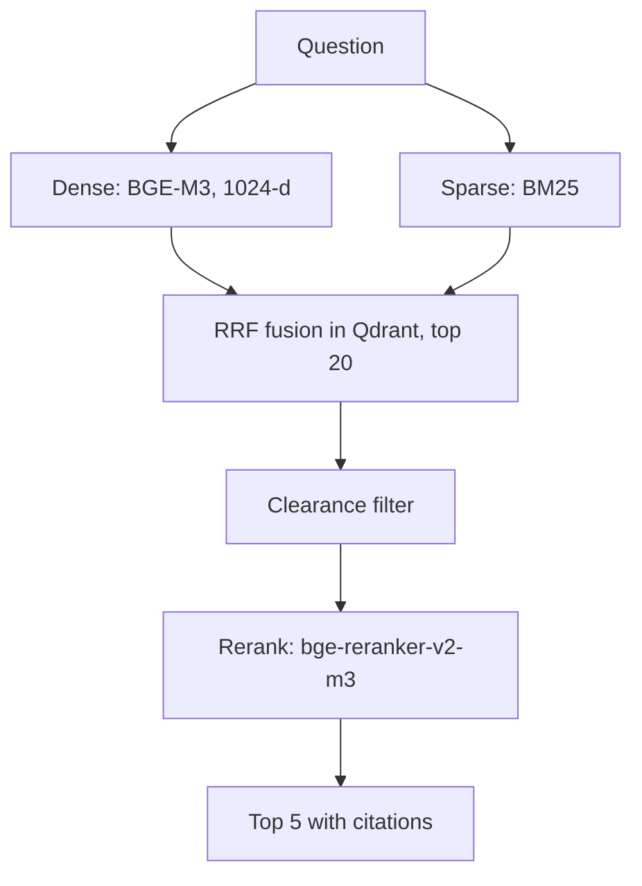

# Hybrid RAG design

Full reference: [`HYBRID_RAG_DESIGN.md`](../HYBRID_RAG_DESIGN.md). Summary below.

## Why hybrid

Dense vectors capture meaning but can miss exact identifiers such as `P-204`. Sparse BM25 captures those exact terms. Fusing both, then reranking, gives relevance and precision.

## Ingestion

1. Parse each PDF page with PyMuPDF.
2. Mark blocks above 1.3x the median font size as headers and store them as `section_title`.
3. Extract each table as one atomic chunk.
4. Chunk body text at 400 tokens with 50 overlap (about 4 characters per token).
5. Embed dense and sparse, upsert to Qdrant with metadata.

## Chunk payload

`chunk_id`, `doc_name`, `page`, `section_title`, `classification_tag`, `text`, `is_table`, `ingested_at`.

## Design-estimate latency

| Step | Estimate |
| --- | --- |
| Query embeddings (CPU) | ~15 ms |
| Prefetch + RRF in Qdrant | ~50 ms |
| Rerank top 20 (CPU) | ~100 ms |
| Total retrieval | ~165 ms |

These are design targets, not benchmarks. Measure on your hardware.
